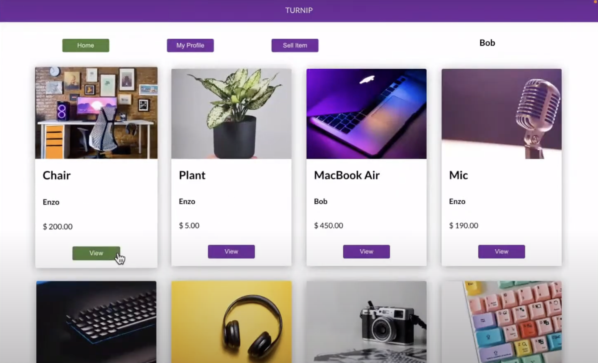

# Turnip App


Welcome to Turnip! It's an app to buy and sell used items.

<div align="center">
    <a href="https://www.youtube.com/live/jLNM3GcS53U?feature=share&t=976"></a>
</div>

## Inspiration

I personally love exploring the used market for hidden gems! Unfortunately, the currently online used markets in Canada and USA are paltry compared to what I've seen in Korea. They have an outdated UI, are bulky, and not pleasant to use. 

So, I decided to make my own version with an improved UI, and thinking more about what users want from a used market app and what they love about the scene.

## Welcome to the Frontend Repo

This is the frontend repository. Here are some links related to the project:

YouTube: [Public Demo of App](https://www.youtube.com/live/jLNM3GcS53U?feature=share&t=976)

Backend Repo: https://github.com/jadeleafmoon/turnip-api-2


## Getting started

To get Turnip to work locally, you will need to download both the frontend repo and [backend repo](https://github.com/jadeleafmoon/turnip-api-2). The following are instructions for the frontend repo.

Download this repository.

Install packages.
```
npm install
```

Make sure to create a local database with `PSQL` called `turnip_api`.

```
CREATE DATABASE turnip_api;
```

## Tech Stack

Turnip was built using the following tech stack.

**Frontend:** 

- **JavaScript** and CSS for logic and styling
- **React** for creating an interactive UI

**Backend:**

- **PostgreSQL** for data storage
- **Node** and **Express** for building the API server
- **Knex** to access the **PostegreSQL** database

**Services:**

- **Railway** for deployment
- **Firebase Storage** for uploading images


## Thanks
Thanks for visiting!

